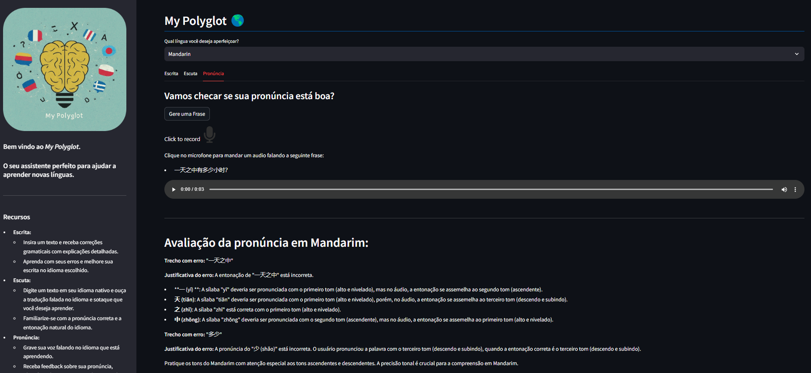

# My Polyglot: Aprenda Idiomas com a Ajuda da IA
<div align="center">
    
</div>

## Sobre o Projeto
**My Polyglot** é um aplicativo web que utiliza a tecnologia de IA do Google para auxiliar no aprendizado de idiomas. Com ele, você pode praticar suas habilidades de escrita, escuta e pronúncia de forma autônoma e personalizada.
Atualmente com suporte para Inglês, Mandarim e Espanhol

## Recursos

* **Escrita:**
    * Insira um texto e receba correções gramaticais com explicações detalhadas.
    * Aprenda com seus erros e melhore sua escrita no idioma escolhido.
    
* **Escuta:**
    * Digite um texto em seu idioma nativo e ouça a tradução falada no idioma e sotaque que você deseja aprender.
    * Familiarize-se com a pronúncia correta e a entonação natural do idioma.
    
* **Pronúncia:**
    * Grave sua voz falando no idioma que está aprendendo.
    * Receba feedback sobre sua pronúncia, identificando erros e sugerindo pontos de melhoria.
    * Acesse links de estudo direcionados para aperfeiçoar sua pronúncia.
    

## Tecnologias Utilizadas

* **Streamlit:** Framework Python para criação de aplicativos web de forma rápida e fácil.
* **Google Generative AI (Gemini):** Modelo de linguagem avançado que potencializa as funcionalidades de processamento de linguagem do aplicativo.
* **Técnicas de Prompt Engineering:** Foram utilizadas técnicas de few-shot learning e ajustes nos parâmetros de temperatura do LLM.
* **gTTS:** Biblioteca Python para conversão de texto em fala.
* **audio_recorder_streamlit:** Componente Streamlit para gravação de áudio diretamente no navegador.

## Como Usar

1. **Clone o repositório:**

```bash
git clone https://github.com/claudiocmm/My_Polyglot_app.git
```

2. **Instale as dependências:**

```bash
pip install -r my_app/requirements.txt
```

3. **Configure sua chave de API:**

    * Obtenha uma chave de API do Google Generative AI e substitua o valor de `API_KEY` no arquivo `app.py` pela sua chave.

4. **Execute o aplicativo:**

```bash
streamlit run my_app/app.py
```

5. **Acesse o aplicativo:** Abra seu navegador web e acesse o endereço `http://localhost:8501`.

## Observações

* As funcionalidades e idiomas disponíveis podem ser expandidos futuramente.

## Contribuições

Sinta-se à vontade para contribuir com o projeto! Você pode sugerir novos recursos, relatar bugs ou enviar pull requests com melhorias.

## Contato
[Linkedin](https://www.linkedin.com/in/claudio-césar-506961164/)